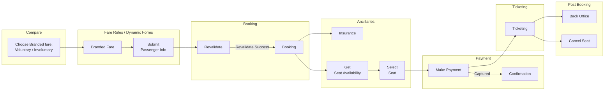

- [[RFC] Seats Availability and Booking in BoW Flights](https://wegomushi.atlassian.net/wiki/spaces/ENG/pages/2732392449/RFC+Seats+Availability+and+Booking+in+BoW+Flights#%5BRFC%5D-Seats-Availability-and-Booking-in-BoW-Flights)
- [Background](https://wegomushi.atlassian.net/wiki/spaces/ENG/pages/2732392449/RFC+Seats+Availability+and+Booking+in+BoW+Flights#Background)
    - [Why now](https://wegomushi.atlassian.net/wiki/spaces/ENG/pages/2732392449/RFC+Seats+Availability+and+Booking+in+BoW+Flights#Why-now)
    - [Goals / definition of success](https://wegomushi.atlassian.net/wiki/spaces/ENG/pages/2732392449/RFC+Seats+Availability+and+Booking+in+BoW+Flights#Goals-%2F-definition-of-success)
    - [Non-goals](https://wegomushi.atlassian.net/wiki/spaces/ENG/pages/2732392449/RFC+Seats+Availability+and+Booking+in+BoW+Flights#Non-goals)
- [Proposal](https://wegomushi.atlassian.net/wiki/spaces/ENG/pages/2732392449/RFC+Seats+Availability+and+Booking+in+BoW+Flights#Proposal)
    -  [ Option 1 - Add Seating to BoW Integration Framework](https://wegomushi.atlassian.net/wiki/spaces/ENG/pages/2732392449/RFC+Seats+Availability+and+Booking+in+BoW+Flights#%F0%9F%8F%AD-Option-1---Add-Seating-to-BoW-Integration-Framework)
- [Abandoned Ideas](https://wegomushi.atlassian.net/wiki/spaces/ENG/pages/2732392449/RFC+Seats+Availability+and+Booking+in+BoW+Flights#Abandoned-Ideas)
- [Decision](https://wegomushi.atlassian.net/wiki/spaces/ENG/pages/2732392449/RFC+Seats+Availability+and+Booking+in+BoW+Flights#Decision)
- [Reviewers](https://wegomushi.atlassian.net/wiki/spaces/ENG/pages/2732392449/RFC+Seats+Availability+and+Booking+in+BoW+Flights#Reviewers)

---
Doc URL: https://wegomushi.atlassian.net/wiki/spaces/ENG/pages/2732392449/RFC+Seats+Availability+and+Booking+in+BoW+Flights
# **[RFC] Seats Availability and Booking in BoW Flights**

**Summary**: Implementation of Seats booking in BoW Flights

|                                                                                                                                                                              |
| ---------------------------------------------------------------------------------------------------------------------------------------------------------------------------- |
| **Status:** Work in progress \| In-review \| Approved \| Obsolete  **Owner:** @Liang Jun  **Contributors:**  **Other stakeholders:**  **Approvers:** |

---

# **Background**

Seating is one of the Airline ancillaries services that BoW flight can provide to generate additional revenue. Seat selection and booking is also a mandatory requirement of certain airlines. Seat selection will also be the first kind of Special Service Request (SSR) we are selling – it will pave the way for setting up or integrating additional SSR selling capabilities.

Being able to integrate and provide seating selection is a no brainer addition to BoW flight’s features.

## Why now

_See Background – or ask_ @Richard Nasser Kua

## Goals / definition of success

1. Users are able to view seating selection and pricing during the booking checkout flow.
    
2. Users are able to select and pay for seat during the booking checkout flow.
    
3. Integrations will have a standardised protocol for Getting, selecting and cancelling seats for a booking.
    
4. Frontend will have a standardised API for Getting, selecting seats for a booking.
    
5. We have a way to cancel seats for Customer Support Postbooking
    

---

## Non-goals

- Seating will use Quicket for frontend, but the engineering of the component and layouts are not part of this RFC. However the standardisation of schema is considered – see goal 4.
    
- Post booking (other than seat cancellation) is not part of this RFC or current scope of the project.
    
- The possible revenue or metrics that will arise from the delivery of this feature is not part of this RFC.
    
- Ability to integrate other SSR sells
    

---

# Proposal

##  Option 1 - Add `Seating` to BoW Integration Framework

The BoW integration framework has been launched for quite sometime and has proven to stable. Additionally it has effectively reduced the overhead required by the BoW team in implementing supplier/provider specific logic.

While each supplier has a specific way to view and/or reserve seats – we should be able to standardise the seat selection flow into to main steps:

- **Get Seats Availability**
    
- **Book/Select Seat**
    

The steps should map 1 to 1 across all our services: **Frontend** ←→ **BoW** ←→ **Integrations.**

In addition there will be 1 more step to consider to facilitate post booking (admin) operations:

- **Cancel Seat**
    

---

### Flow Diagram

Legend:

- **Green – Existing Functions / Entities / Service**
    
- **Orange - Functions / Entities / Service that are New or require Updating**
    

---

###  Get Seats Availability

Retrieve the seats for during the booking checkout flow.

At this point, the user has submitted passenger info and will be shown other ancillaries like Insurance.

We will be basing the request / response interfaces designs closely with what is required by quicket to minimise conversion and the use of redundant wrapper interfaces.

Quicket docs: [https://github.com/Kwiket/jets-seatmap-react-lib-pub/blob/version-3/SEATMAP-INTEGRATION.md#-availability](https://github.com/Kwiket/jets-seatmap-react-lib-pub/blob/version-3/SEATMAP-INTEGRATION.md#-availability "https://github.com/Kwiket/jets-seatmap-react-lib-pub/blob/version-3/SEATMAP-INTEGRATION.md#-availability")

Skip to implementation:

- [Frontend](https://wegomushi.atlassian.net/wiki/spaces/ENG/pages/2732392449/RFC+Seats+Availability+and+Booking+in+BoW+Flights#getSeatsFrontend "#getSeatsFrontend")
    
- [Backend](https://wegomushi.atlassian.net/wiki/spaces/ENG/pages/2732392449/RFC+Seats+Availability+and+Booking+in+BoW+Flights#getSeatsBackend "#getSeatsBackend")
    
- [Integrations](https://wegomushi.atlassian.net/wiki/spaces/ENG/pages/2732392449/RFC+Seats+Availability+and+Booking+in+BoW+Flights#getSeatsIntegrations "#getSeatsIntegrations")
    

---

#### Frontend

**POST - /getSeats**

Retrieve seats availability for a given BoW Booking Entity

#### [FE] GetSeatsAvailabilityRequest

For the request, we don’t need much. We just need the booking ID. Backend will use this to retrieve the rest of the required data (itinerary, segments, passenger info) to construct the response required for seat map / availability.

`** * Request for seats availabiltiy for a given BoW booking. */ interface GetSeatsAvailabilityRequest { bookingId: string; // should we allow retrieval at segment / itinerary level? }`

#### [FE] GetSeatsAvailabilityResponse

For the response we will return some Wego centric information and the the two main `props` required for the seat map to function.

`** * Returns the TSeatAvailability, IFlight details for initializing * Quicket Seatmap component */ interface GetSeatsAvailabilityResponse { bookingId: string; // ... some other tracking information flight: IFlight; seatAvailability: TSeatAvailability; } ** * Quicket types and interfaces * https://github.com/Kwiket/jets-seatmap-react-lib-pub/blob/version-3/SEATMAP-INTEGRATION.md#-flight */ interface IFlight { id: string; airlineCode: string; flightNo: string; departureDate: string; departure: string; arrival: string; cabinClass: string; passengerType?: string; planeCode?: number; startRow?: string; // string [ 3 .. 24 ] characters endRow?: string; // string [ 3 .. 24 ] characters } interface IIncomingSeat { currency: string; label: string; price: number; color?: string; // color of the seat onlyForPassengerType?: TPassengerType[]; additionalProps?: TAdditionalProp[]; // additionalProps from individual seats would exted the list of seat's features // up to 12 features and props could be displayed in tooltip for a seat } type TAdditionalProp = { label: String; icon: String; // suported icons are ["+", "-", "dot", "wifi", "movie", "power"], "dot' is default } type TSeatAvailability = IIncomingSeat[];`

`IFlight` correlates to a BoW `segment`. It is required by Quicket to determine which seat map to provide.

Quicket has a database of seat map versions for each aircraft, airline, schedule etc.

Basically for a given flight/route/segment – it can have a seating layout version even with the same aircraft.

|   |   |   |
|---|---|---|
|**Key**|**Wego Mapping**|**Purpose**|
|`id`|segment id?|identification / tracing|
|`airlineCode`|`operatingAirlineCode`|Determine Aircraft Model and seat layout|
|`flightNo`|`airlineRef`|Determine Aircraft Model and seat layout|
|`departureDate`|`scheduledDepartureDateTimeUtc` formatted to `yyyy-mm-dd`|Determine schedule|
|`departure`|`origin`|Determine schedule|
|`arrival`|`destination`|Determine schedule|
|`cabinClass`|`cabin` mapped to single letter:  - E - economy      - P - premium_economy      - B - business      - F - first|Determine cabin|
|`passengerType?`|`passengerType`  `['ADT', 'CHD', 'INF']`|Filter for passenger?   (This param optional so we can ignore for now.)|
|`startRow?`|`cabinStartRow`  Tells us which rows are at the start of of the cabin. For eg.  Economy starts are row 10 and each row has A, B, C, D, E, F seats (2 left, 2 center, 2 right)  The value will be: `10:ABCDEF`|This is required to get the correct layout version.  We will be retrieving and providing this from supplier|
|`endRow?`|`cabinEndRow`  Required if startRow is provided.  Similar logic applies as `startRow`|This is required to get the correct layout version.|

`TSeatAvailability` or `IIncomingSeat[]` is an array of “seat“ objects. Each `IIncomingSeat` is a list of properties (price, color, ammenities) for a given seat that can be applied globally on the entire seat map / cabin or have specific overrides that can be applied on single seat.

|   |   |   |
|---|---|---|
|**Key**|**Wego Mapping**|**Purpose**|
|`currency`|`currency`  We convert to USD in backend?|For price display|
|`price`|`price`  Number|Price of the seat, for display|
|`label`|`seatNo`  `*` wild card can be specified to apply properties of this seat definition to all seats in the seat map.  or specific `seatNo` to specifically override 1 seat.|Applies seat properties to all or specific seat in the map.|
|`color?`|`color`  We will determine this via seat availability boolean and set a color.  Also can consider sending the boolean instead of color for front end to decide what color to show.|Show if a seat is free or taken.|
|`onlyForPassengerType?`|`passengerType`  Adult, Child, Infant  _Some restrictions may apply for Infant seatings (TBC)_|Applies to seat properties for specific passengerType|
|`additionalProps?`|`seatAmenities[]`||

Example data: https://github.com/Kwiket/jets-seatmap-react-lib-pub/blob/version-3/SEATMAP-INTEGRATION.md#-availability

---

#### **BoW Backend**

The WegoFares backend is the middle man and will handle the getSeatsRequests from the `Booking` perspective. To recap we will be receiving a `bookingId` from front end to start the request for seat availability.

The backend also maps the Integration (Framework) `GetSeatsAvailability` to Frontend’s `GetSeatsAvailability`

Referencing [https://wegomushi.atlassian.net/wiki/spaces/FT/pages/edit-v2/2676654131#%F0%9F%94%8E-Providers-Integration-Framework-Comparison](https://wegomushi.atlassian.net/wiki/spaces/FT/pages/edit-v2/2676654131#%F0%9F%94%8E-Providers-Integration-Framework-Comparison "https://wegomushi.atlassian.net/wiki/spaces/FT/pages/edit-v2/2676654131#%F0%9F%94%8E-Providers-Integration-Framework-Comparison")

Three of the providers (Sabre, Flynas, Travelport) researched require a few common components:

- Segment Information
    
    - the provider identifier OR
        
    - Origin, Destination, Departure Date, Airline Details
        
    - Cabin*
        
- Passenger Information
    
    - Mostly for loyalty purposes
        
- Fare Information (Fare basis) *optional / case by cases basis
    
    - Pricing Purpose
        

For Sabre it might be possible to get away with just using the itinerary gdsRef (PNR) in their stateless API

#### [BE] GetSeatsAvailabilityRequest (Integrations Framework)

At this point of the lifecycle – a `BookingEntity` should have been created.

We will use it to retrieve the info required for a seat availability request.

- Passenger Info - `PassengerEntity`
    
- Segment Info - `ItineraryEntities.LegEntities.SegmentEntity`
    

Both new info classes will have a **supplier specific identifie**r if the supplier seat availability request requires it.

We also send the PNR (`itineraryGdsRef`) if supplier API is able to identify the segment/passenger from PNR directly.

`package wego.curiosity.integrations.bow.seats; public class GetSeatsAvailabilityRequest { private PassengerInfo passengerInfo private SegmentInfo segmentInfo private String itineraryGdsRef private IntegrationType integrationType; private String wegoRef # for providerExchange tracking } public class PassengerInfo extends PassengerEntity { # ... standard passenger entity values private supplierPassengerIdentifier # need by Flynas? } public class SegmentInfo extends SegmentEntity { # ... standard segment entity values private supplierSegmentIdentifier # needed by Travelport? }`

#### [BE] GetSeatsAvailabilityResponse (Integrations Framework)

The response for seat availability / seat map will be standardized to closely match prop requirements from Quicket. See above section. [https://wegomushi.atlassian.net/wiki/spaces/FT/pages/edit-v2/2707128322#%F0%9F%9B%AC-GetSeatsAvailabilityResponse](https://wegomushi.atlassian.net/wiki/spaces/FT/pages/edit-v2/2707128322#%F0%9F%9B%AC-GetSeatsAvailabilityResponse "https://wegomushi.atlassian.net/wiki/spaces/FT/pages/edit-v2/2707128322#%F0%9F%9B%AC-GetSeatsAvailabilityResponse")

There like API response to frontend – the integrations response will have 2 main components:

- FlightInfo
    
    - Used by quicket to select the correct seat map
        
    - This is a combination of it datapoints of itinerary / leg / segment. Notably it will have:
        
        - Airline Code and Flight No
            
        - Departure Date, Origin, Destination
            
        - Cabin Type
            
        - Cabin start / end rows
            
- Seat[]
    
    - This is a list of seats similar to `IIncomingSeat[];` for frontend
        
    - In general the first Seat object should be the generic one which encompasses most of the plane seat map. Subsequent seats should be override or special seats with differing prices/amenities or passenger type requirements
        
        - Seat No - * for apply to all, and specifc number like 11A to override a specific seat
            
        - Price - float number
            
        - CurrencyCode
            
        - SeatAmenenties[] – List of seat description or amenties
            
            - code – Phrase code or something
                
            - description
                
        - PassengerType[] – * apply for all passenger or specific types only
            

`package wego.curiosity.integrations.bow.seats; public class GetSeatsAvailabilityResponse { private FlightInfo flightInfo private Seat[] seats } # We can generate this from SegmentInfo? public class FlightInfo { private String operatingAirlineCode private String airlineRef private CabinType cabin private String cabinStartRow private String cabinEndRow } public class Seat { private String currencyCode private float price private String[] seatNo private boolean available private passengerType[] passengeTypes private String seatAmenenties[] }`

---

### Integrations

Provider specific logic not discussed here. Integrations will build off the existing integration framework (utilising connectors from `eagle`)

---

### Book Seat

After selecting a seat in the Quicket seat map for a passenger, we will make a request to book / reserve the seat selection for the passenger.

---

# Abandoned Ideas

_As RFCs evolve, it is common that there are ideas that are abandoned. Rather than simply deleting them from the document, you should try to organize them into sections that make it clear they're abandoned while explaining why they were abandoned._

---

# Decision

At the end of the RFC, document the decisions that we made here.

---

# Reviewers

|                |        |          |
| -------------- | ------ | -------- |
| Review summary | Status | Reviewer |
|                |        |          |
|                |        |          |
|                |        |          |
|                |        |          |